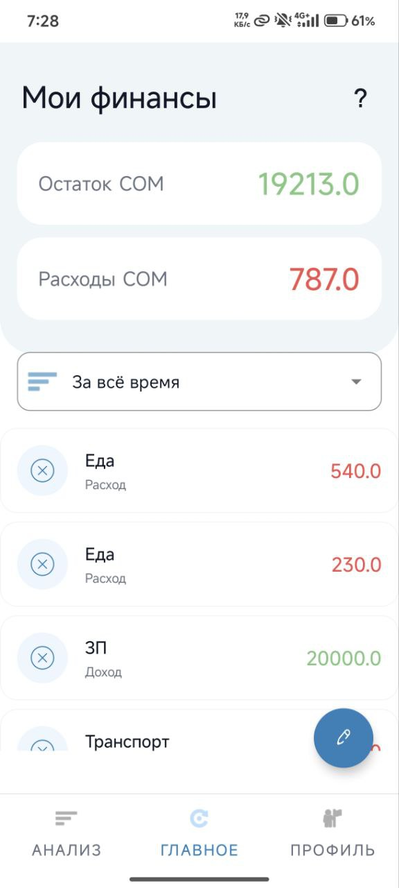
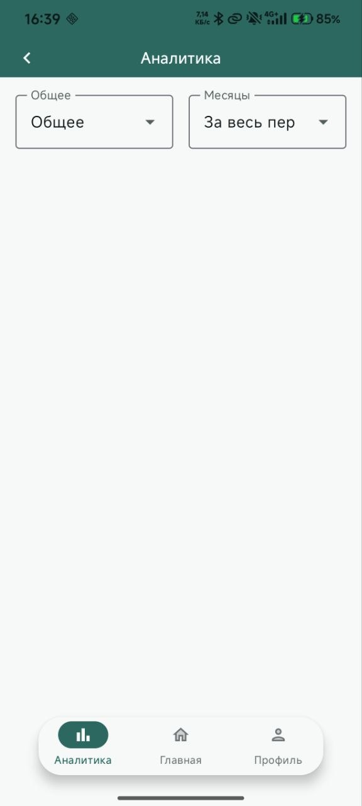
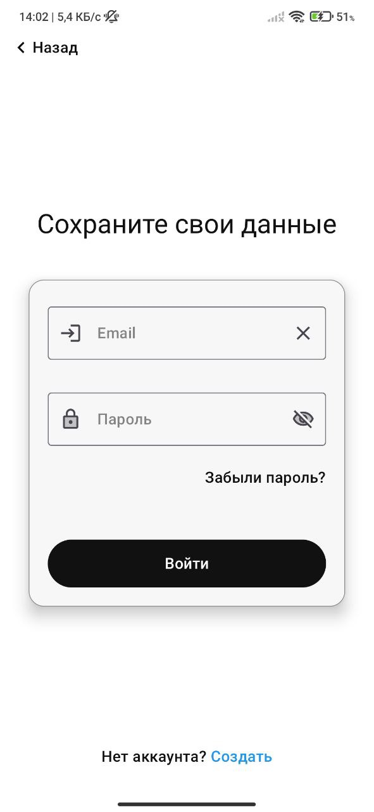
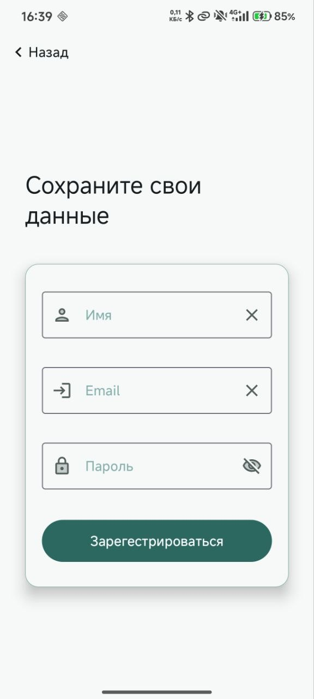

MyFinance: Приложение для учёта личных финансов
=======

# Оглавление
1. [О проекте](#о-проекте)
2. [Ключевые функции](#ключевые-функции)
3. [Используемые технологии и архитектура](#используемые-технологии-и-архитектура)
4. [Стадия проекта](#стадия-проекта)
5. [Скриншоты](#скриншоты)
6. [Контакты](#контакты)

## О проекте

**MyFinance** — это современное и интуитивно понятное Android-приложение, разработанное для
эффективного управления личными финансами. Проект позволяет пользователям легко отслеживать доходы и
расходы, категоризировать транзакции и надёжно хранить данные в облаке, обеспечивая доступ с любого
устройства.

Это приложение было создано как pet-проект с целью демонстрации навыков в разработке на Android с использованием современных архитектурных подходов, лучших практик и передовых технологий.

---

## Ключевые функции
Управление транзакциями: Удобное добавление и просмотр всех финансовых операций.

Настраиваемый интерфейс: Возможность переключаться между светлой и тёмной темой.

---

## Используемые технологии и архитектура
Проект разработан с использованием архитектуры MVVM (Model-View-ViewModel), что обеспечивает чистоту кода, его тестируемость и удобство поддержки.

* **Язык**: Kotlin

* **Мобильная платформа**: Android SDK

* **Архитектура**: MVVM (ViewModel, StateFlow, Repository)

* **Локальное хранилище**: Room

* **Облачные сервисы**: Firebase (Authentication, Firestore)

* **Внедрение зависимостей**: Hilt

* Потоки: Kotlin Coroutines

## Стадия проекта

Проект на данный момент находится в процессе активного рефакторинга и перехода на современный стек:
**Legacy:** Java -> XML(Activity&Fragment)-> LiveData

**Current:** Kotlin -> Jetpack Compose -> StateFlow -> Coroutines -> Hilt

## Скриншоты

<table>
<tr>
<td align="center"><b>Главная</b></td>
<td align="center"><b>Анализ</b></td>
<td align="center"><b>Профиль</b></td>

</tr>
<tr>
<td></td>
<td></td>
<td></td>
</tr>
<tr>
<tr align="center">
<td align="center"><b>Авторизация</b></td>
<td align="center"><b>Регистрация</b></td>
<td></td>
</tr>

<tr>
<td></td>
<td></td>
<td></td>
</tr>

</table>

---

## Контакты

GitHub: [https://github.com/Orazjan](https://github.com/Orazjan)

Email: [orazjanov11@gmail.com](mailto:orazjanov11@gmail.com)
